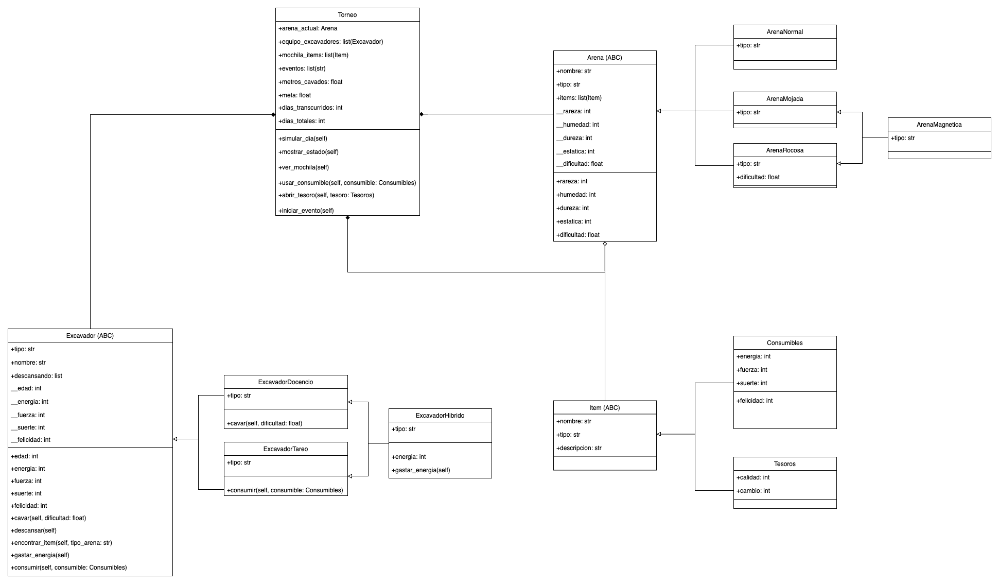

## Explicación del diagrama de clases :octocat:




* La clase ```Arena``` (abstracta) es la base de las clases ```ArenaNormal```, ```ArenaMojada``` y ```ArenaRocosa```. Contiene los elementos básicos que comparten todos los tipos de arenas. Por temas de simplicidad, se repite el atributo tipo en las clases heredadas, lo que implica que se decidió hacer override del atributo tipo, con tal de evitar complejizar el problema. La clase ```ArenaRocosa``` tiene un cálculo distinto de la dificultad, lo que se logra por medio de override del atributo (la property definida en la clase padre se encargará del redondeo a dos decimales). Finalmente, la clase ```ArenaMagnetica``` hereda de ```ArenaMojada``` y ```ArenaRocosa```.
   * Existe una relación de agregación desde la clase ```Item``` hacia ```Arena```: esto se debe a que ```Arena``` contiene atributos que son listas de instancias de las clases que heredan de ```Item```.


* La clase ```Excavador``` (abstracta) es la base de los distintos tipos de excavadores, y contiene los atributos y métodos que todos los excavadores comparten. Las clases ```ExcavadorDocencio``` y ```ExcavadorTareo``` heredan de ```Excavador```, y ```ExcavadorHibrido``` hereda de ```ExcavadorDocencio``` y ```ExcavadorTareo```. Al igual que en las clases ```Arena```, se redefine el atributo tipo como override, y se hace override de los métodos cavar en ```ExcavadorDocencio``` y ```ExcavadorHibrido```, y de consumir en ```ExcavadorTareo```.


* Cabe destacar que las relaciones de composición y agregación están indicadas desde clases que son padres de otras: esto implica que, por ejemplo, si existe una relación de composición desde Item hacia ```Torneo```, entonces también existe esa relación desde Consumibles (que hereda de ```Item```) hacia ```Torneo```.


* Cuando un atributo es de la forma ```atributo: list(Algo)```, implica que se trata de una lista que contiene elementos del tipo ```Algo```: pueden ser str (strings arbitrarios), objetos, etc.
